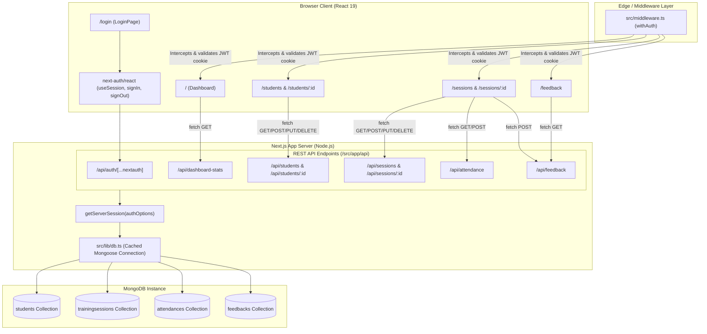

# PROJECT_CONTEXT.md

## Technical Handoff & Architecture Guide
**Repository / Application Name**: CampusPlace (formerly TrainTrack)  
**Package Name**: `campusplace` ([package.json](file:///Users/pratikravan/Desktop/Placement%20Coordination%20Dashboard/package.json#L2))  
**Document Generated**: 2026-10-08  
**Target Audience**: Senior Engineers, AI Coding Agents (Antigravity), and Technical Leads  

---

## 1. PROJECT OVERVIEW

### Core Purpose & Problem Domain
CampusPlace is a centralized web dashboard built for collegiate Training & Placement (T&P) cells, coordinators, and faculty administrators. Prior to this platform, placement officers tracked pre-placement training attendance, workshop schedules, and student sentiment across disconnected spreadsheets and paper logs. 

CampusPlace provides:
- Centralized tracking of enrolled candidates across multiple departments and academic years.
- Scheduling and curriculum tracking for soft-skill, aptitude, and technical preparation sessions.
- Fast, bulk digital attendance marking with department and year-of-study filters.
- Quantitative (1–5 star ratings) and qualitative feedback logging (anonymous or student-attributed).
- Aggregate dashboard performance analytics (average ratings, attendance timelines, upcoming schedules).

### Target Audience
- **Primary**: Placement Officers, Training Coordinators, and Department Faculty Coordinators.
- **Secondary (Potential/Future)**: Corporate Recruiters / Trainers evaluating cohort performance; Students viewing upcoming sessions.

### Current Status & Maturity Level
- **Status**: **Working Prototype / Functional MVP**. Core CRUD capabilities, bulk attendance logging, rating calculations, NextAuth session protection, and UI dashboards are fully implemented and running locally.
- **Maturity**: **v0.1.0 (Early Stage)**. Suitable for demos and internal testing. It relies on a single hardcoded administrator credential set loaded from environment variables (with demo credentials currently exposed in the UI and README), lacks automated testing, has 58 ESLint issues needing cleanup, and does not yet have a multi-tenant or student-facing authenticated portal.

---

## 2. TECH STACK

All versions are cited directly from [package.json](file:///Users/pratikravan/Desktop/Placement%20Coordination%20Dashboard/package.json):

### Core Runtime & Languages
- **Runtime**: Node.js (v20+ recommended, ES2017+ target configured in [tsconfig.json](file:///Users/pratikravan/Desktop/Placement%20Coordination%20Dashboard/tsconfig.json#L3))
- **Language**: TypeScript (`^5`)
- **Execution / Tooling**: `tsx` (`^4.23.1`) for direct TypeScript script execution (database seeding)

### Frontend Framework & UI
- **Framework**: Next.js (`16.2.10`) using App Router architecture (`src/app`)
- **React**: React (`19.2.4`) & React DOM (`19.2.4`)
- **Styling**: Tailwind CSS (`^4`) via PostCSS (`@tailwindcss/postcss: ^4`, [postcss.config.mjs](file:///Users/pratikravan/Desktop/Placement%20Coordination%20Dashboard/postcss.config.mjs))
- **Typography**: Inter font via `next/font/google` ([src/app/layout.tsx](file:///Users/pratikravan/Desktop/Placement%20Coordination%20Dashboard/src/app/layout.tsx#L7-L10))
- **Icons**: Lucide React (`^1.25.0`)
- **Data Visualization**: Recharts (`^3.9.2`)

### Backend & Data Persistence
- **API Architecture**: Next.js App Router Route Handlers (`src/app/api/**/route.ts`)
- **Database**: MongoDB (Local instance or MongoDB Atlas)
- **Object Data Modeling (ODM)**: Mongoose (`^9.7.4`) with global connection caching ([src/lib/db.ts](file:///Users/pratikravan/Desktop/Placement%20Coordination%20Dashboard/src/lib/db.ts))

### Authentication & Security
- **Authentication**: NextAuth.js (`^4.24.14`)
- **Strategy**: JWT (`strategy: 'jwt'`) with `CredentialsProvider` ([src/app/api/auth/[...nextauth]/route.ts](file:///Users/pratikravan/Desktop/Placement%20Coordination%20Dashboard/src/app/api/auth/%5B...nextauth%5D/route.ts#L6-L37))
- **Route Guarding**: Next.js Edge Middleware ([src/middleware.ts](file:///Users/pratikravan/Desktop/Placement%20Coordination%20Dashboard/src/middleware.ts)) + `getServerSession(authOptions)` validation across all API handlers

### Linting & Code Standards
- **Linter**: ESLint (`^9`) with `eslint-config-next` (`16.2.10`), flat configuration format ([eslint.config.mjs](file:///Users/pratikravan/Desktop/Placement%20Coordination%20Dashboard/eslint.config.mjs))

### Hosting, CI/CD & Third-Party Integrations
- **Hosting**: Configured for Vercel deployment (standard Next.js build output).
- **Third-Party Services**: No external SaaS dependencies (e.g., Stripe, SendGrid, S3) are currently integrated; all data is local/MongoDB-backed.

---

## 3. FOLDER STRUCTURE

```
/Users/pratikravan/Desktop/Placement Coordination Dashboard/
├── .env.example                     # Sample configuration specifying required environment variable names
├── .gitignore                       # Git ignore list (node_modules, .next, .env, build output)
├── eslint.config.mjs                # ESLint 9 flat configuration with next-vitals and typescript extensions
├── next-env.d.ts                    # Next.js TypeScript ambient type declarations
├── next.config.ts                   # Next.js configuration object (empty defaults)
├── package.json                     # Project manifest, dependencies, and NPM scripts
├── package-lock.json                # Locked dependency tree
├── postcss.config.mjs               # PostCSS configuration injecting @tailwindcss/postcss plugin
├── README.md                        # Project documentation, quickstart guide, and demo credentials
├── tsconfig.json                    # TypeScript compiler options (paths: @/* -> ./src/*)
│
├── public/                          # Public static assets served at root /
│   ├── file.svg                     # Next.js template SVG icon
│   ├── globe.svg                    # Next.js template SVG icon
│   ├── next.svg                     # Next.js framework SVG logo
│   ├── vercel.svg                   # Vercel platform SVG logo
│   └── window.svg                   # Next.js template SVG icon
│
├── scripts/                         # Standalone operational scripts
│   └── seed.ts                      # TSX script to reset MongoDB and seed mock students, sessions, attendance, feedback
│
├── test-results/                    # Test artifacts directory
│   └── .last-run.json               # Recorded status of past test runner attempt (status: failed, no active tests)
│
└── src/                             # Main application source code
    ├── middleware.ts                # NextAuth route protection middleware for protected pages
    │
    ├── lib/                         # Shared utilities and foundational libraries
    │   └── db.ts                    # Mongoose cached connection pooling function (dbConnect)
    │
    ├── models/                      # Mongoose data schema definitions
    │   ├── Attendance.ts            # Schema and model for student attendance per training session
    │   ├── Feedback.ts              # Schema and model for rating and qualitative session feedback
    │   ├── Student.ts               # Schema and model for student records (name, roll, branch, year)
    │   └── TrainingSession.ts       # Schema and model for training workshops and syllabus metadata
    │
    ├── components/                  # Reusable UI React components
    │   ├── DashboardChart.tsx       # Recharts responsive bar chart component for session ratings
    │   ├── Header.tsx               # Top navigational bar displaying route title, user name, and logout action
    │   ├── LayoutWrapper.tsx        # Client shell managing sidebar toggling, responsive layout, and login isolation
    │   ├── Modal.tsx                # Accessible backdrop modal dialog wrapper for forms
    │   ├── Providers.tsx            # Root Client Component wrapping children in NextAuth SessionProvider
    │   └── Sidebar.tsx              # Dark-themed navigational sidebar with links and active-state highlights
    │
    └── app/                         # Next.js App Router root
        ├── favicon.ico              # Browser favicon icon
        ├── globals.css              # Global styles, Tailwind CSS v4 import, CSS variables, and base typography
        ├── layout.tsx               # Root HTML layout loading Inter font, Providers, and LayoutWrapper
        ├── page.tsx                 # Main Dashboard overview screen (KPI metrics, chart, upcoming sessions)
        │
        ├── login/                   # Authentication route
        │   └── page.tsx             # Admin login form with credentials submit and autofill helper button
        │
        ├── students/                # Student management section
        │   ├── page.tsx             # Student directory table with department/year filters, search, add, edit, delete
        │   └── [id]/                # Dynamic student detail route
        │       └── page.tsx         # Individual student profile view (attendance timeline and feedback history)
        │
        ├── sessions/                # Training session management section
        │   ├── page.tsx             # Training sessions card grid with add, edit, delete, and detail links
        │   └── [id]/                # Dynamic session detail route
        │       └── page.tsx         # Session control panel (bulk attendance sheet + feedback logging form)
        │
        ├── feedback/                # Feedback logs section
        │   └── page.tsx             # Filterable feedback cards directory by training session
        │
        └── api/                     # Backend REST API route handlers
            ├── auth/                # NextAuth endpoints
            │   └── [...nextauth]/
            │       └── route.ts     # NextAuth configuration with CredentialsProvider and JWT strategy
            ├── dashboard-stats/
            │   └── route.ts         # GET endpoint aggregating dashboard totals, upcoming sessions, and ratings
            ├── students/
            │   ├── route.ts         # GET (list students), POST (create student)
            │   └── [id]/
            │       └── route.ts     # GET (single student + history), PUT (update), DELETE (cascade delete)
            ├── sessions/
            │   ├── route.ts         # GET (list sessions), POST (create session)
            │   └── [id]/
            │       └── route.ts     # GET (single session + students + records), PUT (update), DELETE (cascade delete)
            ├── attendance/
            │   └── route.ts         # GET (filter attendance by sessionId), POST (bulk upsert attendance records)
            └── feedback/
                └── route.ts         # GET (filter feedback by sessionId), POST (create new rating and comment)
```

---

## 4. ARCHITECTURE

### High-Level Topology
CampusPlace is built as a unified monolithic Next.js App Router application. Both client-rendered UI pages and server-executed REST Route Handlers live in the same repository under `src/app`.



### Main User Request / Data Flows

1. **Authentication Flow**:
   - User inputs credentials at `/login` ([src/app/login/page.tsx](file:///Users/pratikravan/Desktop/Placement%20Coordination%20Dashboard/src/app/login/page.tsx)).
   - `signIn('credentials', ...)` sends payload to `/api/auth/callback/credentials`.
   - `authorize()` in [src/app/api/auth/[...nextauth]/route.ts](file:///Users/pratikravan/Desktop/Placement%20Coordination%20Dashboard/src/app/api/auth/%5B...nextauth%5D/route.ts#L12-L32) compares the submission with `process.env.ADMIN_EMAIL` and `process.env.ADMIN_PASSWORD`.
   - On match, NextAuth issues an encrypted JWT session cookie.
   - Subsequent navigation is evaluated by [src/middleware.ts](file:///Users/pratikravan/Desktop/Placement%20Coordination%20Dashboard/src/middleware.ts), redirecting unauthenticated traffic back to `/login`.

2. **Dashboard Overview Flow**:
   - `src/app/page.tsx` mounts and issues `fetch('/api/dashboard-stats')`.
   - Route handler checks session with `getServerSession(authOptions)`.
   - Executes MongoDB queries:
     - `Student.countDocuments()`
     - `TrainingSession.countDocuments()`
     - `Feedback.aggregate()` for global average rating
     - `Feedback.aggregate()` grouped by `$sessionId` mapped to chronological sessions
     - `TrainingSession.find({ date: { $gte: today } })` limit 5 for upcoming workshops.
   - Returns consolidated JSON. Frontend displays KPI cards and renders [src/components/DashboardChart.tsx](file:///Users/pratikravan/Desktop/Placement%20Coordination%20Dashboard/src/components/DashboardChart.tsx).

3. **Attendance Sheet Bulk Operation Flow**:
   - Officer visits `/sessions/[id]` ([src/app/sessions/[id]/page.tsx](file:///Users/pratikravan/Desktop/Placement%20Coordination%20Dashboard/src/app/sessions/%5Bid%5D/page.tsx)).
   - Route fetches session details, all registered students, and existing marked records.
   - Page maintains a local `Record<string, boolean>` state. Officer toggles Present/Absent or clicks "Mark visible Present".
   - Clicking "Save Attendance" submits payload `{ sessionId, records: [{ studentId, present }, ...] }` to `POST /api/attendance` ([src/app/api/attendance/route.ts](file:///Users/pratikravan/Desktop/Placement%20Coordination%20Dashboard/src/app/api/attendance/route.ts)).
   - Server runs a Mongoose `Attendance.bulkWrite()` with `updateOne` and `{ upsert: true }`, ensuring atomicity and idempotency.

4. **Cascade Deletion Flow**:
   - Deleting a student (`DELETE /api/students/[id]`) automatically triggers `Attendance.deleteMany({ studentId: id })` and `Feedback.deleteMany({ studentId: id })`.
   - Deleting a session (`DELETE /api/sessions/[id]`) automatically triggers `Attendance.deleteMany({ sessionId: id })` and `Feedback.deleteMany({ sessionId: id })`.

### Design Patterns Used
- **Connection Caching Pattern (Singleton)**: [src/lib/db.ts](file:///Users/pratikravan/Desktop/Placement%20Coordination%20Dashboard/src/lib/db.ts) maintains a global mongoose connection object across Node.js hot-reloads and serverless function executions.
- **Client Shell Pattern**: [src/components/LayoutWrapper.tsx](file:///Users/pratikravan/Desktop/Placement%20Coordination%20Dashboard/src/components/LayoutWrapper.tsx) reads current pathname, selectively hides headers/sidebars for `/login`, and provides mobile sidebar drawer toggling.
- **RESTful Resource Controller Pattern**: API routes match standard HTTP verbs (`GET`, `POST`, `PUT`, `DELETE`) with explicit status codes (200, 201, 400, 401, 404, 500).
- **Optimistic/Bulk Write Pattern**: Attendance utilizes Mongoose `bulkWrite` with upsert filters.

---

## 5. FEATURES

| Feature Name | Description | Key Files Involved | Status | Notes / Limitations |
| :--- | :--- | :--- | :--- | :--- |
| **Admin Authentication** | Single-admin login via credentials, JWT session token generation, session logout. | [login/page.tsx](file:///Users/pratikravan/Desktop/Placement%20Coordination%20Dashboard/src/app/login/page.tsx), [api/auth/[...nextauth]/route.ts](file:///Users/pratikravan/Desktop/Placement%20Coordination%20Dashboard/src/app/api/auth/%5B...nextauth%5D/route.ts), [middleware.ts](file:///Users/pratikravan/Desktop/Placement%20Coordination%20Dashboard/src/middleware.ts) | Complete | Plaintext env password check; hardcoded demo credentials in UI. |
| **Dashboard KPIs & Charts** | Real-time counts (students, sessions, average rating), upcoming sessions widget, and Recharts rating bar chart. | [app/page.tsx](file:///Users/pratikravan/Desktop/Placement%20Coordination%20Dashboard/src/app/page.tsx), [api/dashboard-stats/route.ts](file:///Users/pratikravan/Desktop/Placement%20Coordination%20Dashboard/src/app/api/dashboard-stats/route.ts), [DashboardChart.tsx](file:///Users/pratikravan/Desktop/Placement%20Coordination%20Dashboard/src/components/DashboardChart.tsx) | Complete | Lint error in `DashboardChart` (inline component definition). |
| **Student Directory (CRUD)** | List, register, modify, and delete students with unique roll numbers. | [students/page.tsx](file:///Users/pratikravan/Desktop/Placement%20Coordination%20Dashboard/src/app/students/page.tsx), [api/students/route.ts](file:///Users/pratikravan/Desktop/Placement%20Coordination%20Dashboard/src/app/api/students/route.ts), [api/students/[id]/route.ts](file:///Users/pratikravan/Desktop/Placement%20Coordination%20Dashboard/src/app/api/students/%5Bid%5D/route.ts) | Complete | Client-side search and filtering; no server-side pagination. |
| **Department & Year Filtering** | Interactive filter pills and select dropdowns categorized by branch and year of study. | [students/page.tsx](file:///Users/pratikravan/Desktop/Placement%20Coordination%20Dashboard/src/app/students/page.tsx) | Complete | Dynamic badge counters per department and year. |
| **Student Profile View** | Detailed candidate sheet showing contact info, historical attendance rate, and session feedback. | [students/[id]/page.tsx](file:///Users/pratikravan/Desktop/Placement%20Coordination%20Dashboard/src/app/students/%5Bid%5D/page.tsx), [api/students/[id]/route.ts](file:///Users/pratikravan/Desktop/Placement%20Coordination%20Dashboard/src/app/api/students/%5Bid%5D/route.ts) | Complete | Contains unused variable `attendanceRate` with artificial multiplier. |
| **Training Sessions (CRUD)** | Schedule workshops, view chronological list with badges (Upcoming vs. Completed), edit details, delete. | [sessions/page.tsx](file:///Users/pratikravan/Desktop/Placement%20Coordination%20Dashboard/src/app/sessions/page.tsx), [api/sessions/route.ts](file:///Users/pratikravan/Desktop/Placement%20Coordination%20Dashboard/src/app/api/sessions/route.ts), [api/sessions/[id]/route.ts](file:///Users/pratikravan/Desktop/Placement%20Coordination%20Dashboard/src/app/api/sessions/%5Bid%5D/route.ts) | Complete | Fully functional. |
| **Bulk Attendance Marking** | Attendance checklist per session with individual Present/Absent toggles, department filters, and bulk "Mark all". | [sessions/[id]/page.tsx](file:///Users/pratikravan/Desktop/Placement%20Coordination%20Dashboard/src/app/sessions/%5Bid%5D/page.tsx), [api/attendance/route.ts](file:///Users/pratikravan/Desktop/Placement%20Coordination%20Dashboard/src/app/api/attendance/route.ts) | Complete | Uses Mongoose bulkWrite upserts. |
| **Feedback Logging** | Submitting 1–5 star reviews and comments per session, with anonymous or student-linked attribution. | [sessions/[id]/page.tsx](file:///Users/pratikravan/Desktop/Placement%20Coordination%20Dashboard/src/app/sessions/%5Bid%5D/page.tsx), [api/feedback/route.ts](file:///Users/pratikravan/Desktop/Placement%20Coordination%20Dashboard/src/app/api/feedback/route.ts) | Complete | Validated on server (1–5 integer range check). |
| **Feedback Directory** | Global view of all session reviews with dropdown filter by specific session. | [feedback/page.tsx](file:///Users/pratikravan/Desktop/Placement%20Coordination%20Dashboard/src/app/feedback/page.tsx), [api/feedback/route.ts](file:///Users/pratikravan/Desktop/Placement%20Coordination%20Dashboard/src/app/api/feedback/route.ts) | Complete | Fully functional. |
| **Mock Database Seeder** | Script populating 16 students, 6 sessions, realistic attendance distributions, and qualitative feedback. | [scripts/seed.ts](file:///Users/pratikravan/Desktop/Placement%20Coordination%20Dashboard/scripts/seed.ts), [package.json](file:///Users/pratikravan/Desktop/Placement%20Coordination%20Dashboard/package.json#L10) | Complete | Executable via `npm run seed`. |

### Half-Built or Planned Features
- **Student Self-Service Portal**: Planned / NOT FOUND. Currently, only the admin can submit feedback or view profiles. Students have no direct login.
- **Export to CSV / Excel**: Planned / NOT FOUND. T&P cells frequently require exporting attendance logs and student lists for corporate partners or accreditation bodies.
- **Placement Drive / Job Tracker**: Planned / NOT FOUND. Currently tracks training sessions only; does not track recruitment drives, applications, or job offers.

---

## 6. DATABASE & DATA MODELS

All models reside in `src/models/` and compile on top of Mongoose.

### 1. `Student` Collection
- **Model File**: [src/models/Student.ts](file:///Users/pratikravan/Desktop/Placement%20Coordination%20Dashboard/src/models/Student.ts)
- **Collection Name**: `students`

| Field | Type | Required | Unique | Default | Description |
| :--- | :--- | :--- | :--- | :--- | :--- |
| `name` | `String` | Yes | No | — | Full name of the candidate |
| `rollNumber` | `String` | Yes | **Yes** | — | Unique institutional identifier (e.g., `22CS001`) |
| `branch` | `String` | No | No | `""` | Department (e.g., `Computer Science & Engineering`) |
| `year` | `String` | No | No | `""` | Year of study (e.g., `3rd Year`) |
| `email` | `String` | No | No | `""` | Institutional or personal email address |
| `createdAt` | `Date` | No | No | `Date.now` | Registration timestamp |

### 2. `TrainingSession` Collection
- **Model File**: [src/models/TrainingSession.ts](file:///Users/pratikravan/Desktop/Placement%20Coordination%20Dashboard/src/models/TrainingSession.ts)
- **Collection Name**: `trainingsessions`

| Field | Type | Required | Unique | Default | Description |
| :--- | :--- | :--- | :--- | :--- | :--- |
| `title` | `String` | Yes | No | — | Name of training or workshop topic |
| `date` | `Date` | Yes | No | — | Scheduled date and time |
| `trainer` | `String` | No | No | `""` | Instructor, guest lecturer, or trainer name |
| `description` | `String` | No | No | `""` | Syllabus outline or prerequisites |
| `createdAt` | `Date` | No | No | `Date.now` | Creation timestamp |

### 3. `Attendance` Collection
- **Model File**: [src/models/Attendance.ts](file:///Users/pratikravan/Desktop/Placement%20Coordination%20Dashboard/src/models/Attendance.ts)
- **Collection Name**: `attendances`

| Field | Type | Required | References | Default | Description |
| :--- | :--- | :--- | :--- | :--- | :--- |
| `sessionId` | `Schema.Types.ObjectId` | Yes | `TrainingSession` | — | Target session foreign key |
| `studentId` | `Schema.Types.ObjectId` | Yes | `Student` | — | Target student foreign key |
| `present` | `Boolean` | Yes | — | — | `true` if attended, `false` if absent |
| `markedAt` | `Date` | No | — | `Date.now` | Timestamp when status was saved |

- **Indexes**:
  - Compound Unique Index: `{ sessionId: 1, studentId: 1 }` with `{ unique: true }` ([src/models/Attendance.ts#L18](file:///Users/pratikravan/Desktop/Placement%20Coordination%20Dashboard/src/models/Attendance.ts#L18)). Prevents duplicate attendance records for a student within the same session.

### 4. `Feedback` Collection
- **Model File**: [src/models/Feedback.ts](file:///Users/pratikravan/Desktop/Placement%20Coordination%20Dashboard/src/models/Feedback.ts)
- **Collection Name**: `feedbacks`

| Field | Type | Required | References | Validation / Default | Description |
| :--- | :--- | :--- | :--- | :--- | :--- |
| `sessionId` | `Schema.Types.ObjectId` | Yes | `TrainingSession` | — | Target training session |
| `studentId` | `Schema.Types.ObjectId` | No | `Student` | `default: null` | Optional student ID (null if anonymous) |
| `rating` | `Number` | Yes | — | `min: 1, max: 5` | Integer score between 1 and 5 |
| `comment` | `String` | No | — | `""` | Qualitative notes/remarks |
| `createdAt` | `Date` | No | — | `Date.now` | Submission timestamp |

---

## 7. API / ROUTES

All routes require authentication via NextAuth session cookie (`getServerSession(authOptions)`). Unauthenticated requests receive `401 Unauthorized`.

| Method | Endpoint Path | Source File | Purpose | Auth Required | Request Payload Shape | Response Shape / Code |
| :--- | :--- | :--- | :--- | :---: | :--- | :--- |
| `GET` | `/api/dashboard-stats` | [dashboard-stats/route.ts](file:///Users/pratikravan/Desktop/Placement%20Coordination%20Dashboard/src/app/api/dashboard-stats/route.ts) | Fetch high-level counts, ratings, and upcoming sessions | Yes | None | `200`: `{ totalStudents, totalSessions, averageRating, sessionRatings: [], upcomingSessions: [] }` |
| `GET` | `/api/students` | [students/route.ts](file:///Users/pratikravan/Desktop/Placement%20Coordination%20Dashboard/src/app/api/students/route.ts) | Retrieve all students sorted alphabetically | Yes | None | `200`: `Student[]` |
| `POST` | `/api/students` | [students/route.ts](file:///Users/pratikravan/Desktop/Placement%20Coordination%20Dashboard/src/app/api/students/route.ts) | Register a new student | Yes | `{ name, rollNumber, branch?, year?, email? }` | `201`: `Student` object<br/>`400`: `{ error: string }` |
| `GET` | `/api/students/[id]` | [students/[id]/route.ts](file:///Users/pratikravan/Desktop/Placement%20Coordination%20Dashboard/src/app/api/students/%5Bid%5D/route.ts) | Fetch student profile, attendance history, and reviews | Yes | None | `200`: `{ student, attendance: [], feedback: [] }`<br/>`404`: `{ error }` |
| `PUT` | `/api/students/[id]` | [students/[id]/route.ts](file:///Users/pratikravan/Desktop/Placement%20Coordination%20Dashboard/src/app/api/students/%5Bid%5D/route.ts) | Update student fields | Yes | `{ name, rollNumber, branch?, year?, email? }` | `200`: Updated `Student`<br/>`400` / `404`: `{ error }` |
| `DELETE` | `/api/students/[id]` | [students/[id]/route.ts](file:///Users/pratikravan/Desktop/Placement%20Coordination%20Dashboard/src/app/api/students/%5Bid%5D/route.ts) | Cascade delete student and related attendance/feedback | Yes | None | `200`: `{ message: string }`<br/>`404`: `{ error }` |
| `GET` | `/api/sessions` | [sessions/route.ts](file:///Users/pratikravan/Desktop/Placement%20Coordination%20Dashboard/src/app/api/sessions/route.ts) | Retrieve all sessions sorted by date descending | Yes | None | `200`: `TrainingSession[]` |
| `POST` | `/api/sessions` | [sessions/route.ts](file:///Users/pratikravan/Desktop/Placement%20Coordination%20Dashboard/src/app/api/sessions/route.ts) | Create a new training session | Yes | `{ title, date, trainer?, description? }` | `201`: `TrainingSession`<br/>`400`: `{ error }` |
| `GET` | `/api/sessions/[id]` | [sessions/[id]/route.ts](file:///Users/pratikravan/Desktop/Placement%20Coordination%20Dashboard/src/app/api/sessions/%5Bid%5D/route.ts) | Fetch session details, full student list, attendance & feedback | Yes | None | `200`: `{ session, students: [], attendance: [], feedback: [] }`<br/>`404`: `{ error }` |
| `PUT` | `/api/sessions/[id]` | [sessions/[id]/route.ts](file:///Users/pratikravan/Desktop/Placement%20Coordination%20Dashboard/src/app/api/sessions/%5Bid%5D/route.ts) | Update session attributes | Yes | `{ title, date, trainer?, description? }` | `200`: Updated `TrainingSession`<br/>`400` / `404`: `{ error }` |
| `DELETE` | `/api/sessions/[id]` | [sessions/[id]/route.ts](file:///Users/pratikravan/Desktop/Placement%20Coordination%20Dashboard/src/app/api/sessions/%5Bid%5D/route.ts) | Cascade delete session and related attendance/feedback | Yes | None | `200`: `{ message: string }`<br/>`404`: `{ error }` |
| `GET` | `/api/attendance` | [attendance/route.ts](file:///Users/pratikravan/Desktop/Placement%20Coordination%20Dashboard/src/app/api/attendance/route.ts) | Query attendance list by `?sessionId=xyz` | Yes | Query param: `sessionId` | `200`: `Attendance[]` (populated studentId)<br/>`400`: `{ error }` |
| `POST` | `/api/attendance` | [attendance/route.ts](file:///Users/pratikravan/Desktop/Placement%20Coordination%20Dashboard/src/app/api/attendance/route.ts) | Bulk upsert attendance records for a session | Yes | `{ sessionId: string, records: [{ studentId, present }] }` | `200`: `{ message: string }`<br/>`400`: `{ error }` |
| `GET` | `/api/feedback` | [feedback/route.ts](file:///Users/pratikravan/Desktop/Placement%20Coordination%20Dashboard/src/app/api/feedback/route.ts) | Query feedback list (optional `?sessionId=xyz`) | Yes | Query param: `sessionId` (optional) | `200`: `Feedback[]` (populated studentId, sessionId) |
| `POST` | `/api/feedback` | [feedback/route.ts](file:///Users/pratikravan/Desktop/Placement%20Coordination%20Dashboard/src/app/api/feedback/route.ts) | Record feedback for a training session | Yes | `{ sessionId, studentId?, rating: 1-5, comment? }` | `201`: `Feedback`<br/>`400`: `{ error }` |
| `GET`/`POST` | `/api/auth/[...nextauth]` | [auth/[...nextauth]/route.ts](file:///Users/pratikravan/Desktop/Placement%20Coordination%20Dashboard/src/app/api/auth/%5B...nextauth%5D/route.ts) | NextAuth OAuth/credentials handler | No | Form data / JSON credentials | NextAuth session cookies / tokens |

---

## 8. AUTHENTICATION & AUTHORIZATION

### Mechanisms & Token Management
- Implemented with **NextAuth.js v4** ([src/app/api/auth/[...nextauth]/route.ts](file:///Users/pratikravan/Desktop/Placement%20Coordination%20Dashboard/src/app/api/auth/%5B...nextauth%5D/route.ts)).
- Uses the **JWT strategy** (`session: { strategy: 'jwt' }`).
- Uses `CredentialsProvider` with `email` and `password` inputs.

### Credential Verification
- Compares submitted email and password directly to `process.env.ADMIN_EMAIL` and `process.env.ADMIN_PASSWORD`.
- If matched, returns:
  ```ts
  {
    id: 'admin',
    name: 'Placement Admin',
    email: adminEmail,
  }
  ```
- **There is no database-backed User collection and passwords are not hashed with bcrypt/argon2.**

### Route Protection Architecture
1. **Frontend / Page Route Protection**:
   - [src/middleware.ts](file:///Users/pratikravan/Desktop/Placement%20Coordination%20Dashboard/src/middleware.ts) uses `withAuth` to protect page routes.
   - Matcher config:
     ```ts
     matcher: ["/((?!login|api/auth|_next/static|_next/image|favicon.ico|api/).*)"]
     ```
   - Redirects unauthenticated page requests to `/login`.
2. **API Route Protection**:
   - Middleware regex excludes `api/`.
   - Every individual API handler explicitly calls:
     ```ts
     const session = await getServerSession(authOptions);
     if (!session) {
       return NextResponse.json({ error: 'Unauthorized' }, { status: 401 });
     }
     ```
   - This provides defense-in-depth even if middleware path matching changes.

---

## 9. FRONTEND DETAILS

### Routing Structure
The application uses Next.js App Router file-system routing:
- `/` -> [src/app/page.tsx](file:///Users/pratikravan/Desktop/Placement%20Coordination%20Dashboard/src/app/page.tsx) (Dashboard Overview)
- `/login` -> [src/app/login/page.tsx](file:///Users/pratikravan/Desktop/Placement%20Coordination%20Dashboard/src/app/login/page.tsx) (Admin Login)
- `/students` -> [src/app/students/page.tsx](file:///Users/pratikravan/Desktop/Placement%20Coordination%20Dashboard/src/app/students/page.tsx) (Student Directory)
- `/students/[id]` -> [src/app/students/[id]/page.tsx](file:///Users/pratikravan/Desktop/Placement%20Coordination%20Dashboard/src/app/students/%5Bid%5D/page.tsx) (Student Profile)
- `/sessions` -> [src/app/sessions/page.tsx](file:///Users/pratikravan/Desktop/Placement%20Coordination%20Dashboard/src/app/sessions/page.tsx) (Sessions Grid)
- `/sessions/[id]` -> [src/app/sessions/[id]/page.tsx](file:///Users/pratikravan/Desktop/Placement%20Coordination%20Dashboard/src/app/sessions/%5Bid%5D/page.tsx) (Session Attendance Sheet & Feedback)
- `/feedback` -> [src/app/feedback/page.tsx](file:///Users/pratikravan/Desktop/Placement%20Coordination%20Dashboard/src/app/feedback/page.tsx) (Feedback Logs)

### Component Hierarchy
- **[layout.tsx](file:///Users/pratikravan/Desktop/Placement%20Coordination%20Dashboard/src/app/layout.tsx)** (Server Root)
  - **[Providers.tsx](file:///Users/pratikravan/Desktop/Placement%20Coordination%20Dashboard/src/components/Providers.tsx)** (`SessionProvider`)
    - **[LayoutWrapper.tsx](file:///Users/pratikravan/Desktop/Placement%20Coordination%20Dashboard/src/components/LayoutWrapper.tsx)**
      - If pathname is `/login`: renders `<main>` without chrome.
      - Otherwise renders:
        - **[Sidebar.tsx](file:///Users/pratikravan/Desktop/Placement%20Coordination%20Dashboard/src/components/Sidebar.tsx)** (Desktop sidebar / mobile drawer overlay)
        - **[Header.tsx](file:///Users/pratikravan/Desktop/Placement%20Coordination%20Dashboard/src/components/Header.tsx)** (Mobile hamburger button, dynamic page title, admin badge, logout button)
        - `<main>` container hosting the active page.

### State Management
- No external state management store (Redux, Zustand, Recoil).
- Relies on React primitives: `useState`, `useEffect`, and `useMemo`.
- Client-side data fetching via native `fetch()` calls in `useEffect`.

### Styling & Design System
- **Tailwind CSS v4**: Imported via `@import "tailwindcss";` in [src/app/globals.css](file:///Users/pratikravan/Desktop/Placement%20Coordination%20Dashboard/src/app/globals.css).
- Theme font set to `--font-inter`.
- Consistent color palette: Slate neutrals (`bg-slate-50`, `border-slate-100`, `text-slate-800`), Blue accents (`bg-blue-600`, `hover:bg-blue-700`), Emerald green for present statuses, Amber for star ratings, and Red for absences and destructive actions.
- Modals utilize fixed backdrops with `bg-slate-900/40 backdrop-blur-sm` ([src/components/Modal.tsx](file:///Users/pratikravan/Desktop/Placement%20Coordination%20Dashboard/src/components/Modal.tsx#L20)).

---

## 10. CONFIGURATION & SETUP

### Prerequisites
- **Node.js**: v18.18.0 or later (v20+ recommended).
- **npm**: v9+ (or pnpm / yarn / bun).
- **MongoDB**: A running local MongoDB instance on port 27017 or a MongoDB Atlas connection string.

### Environment Variables
Configure a `.env` file in the project root based on [.env.example](file:///Users/pratikravan/Desktop/Placement%20Coordination%20Dashboard/.env.example):

| Variable Name | Purpose | Example / Format |
| :--- | :--- | :--- |
| `MONGODB_URI` | MongoDB connection URI string | `mongodb://localhost:27017/traintrack` or Atlas URI |
| `NEXTAUTH_SECRET` | Secret key used to encrypt NextAuth JWT tokens | Generated via `openssl rand -base64 32` |
| `NEXTAUTH_URL` | Canonical root URL of the deployment | `http://localhost:3000` |
| `ADMIN_EMAIL` | Admin login email address | `admin@example.com` |
| `ADMIN_PASSWORD` | Admin login password | `SuperSecretPassword123!` |

*(Note: Never commit `.env` to source control. It is ignored in [.gitignore](file:///Users/pratikravan/Desktop/Placement%20Coordination%20Dashboard/.gitignore#L25).)*

### Installation & Execution Commands

```bash
# 1. Install dependencies
npm install

# 2. Seed database with mock students, sessions, attendance, and feedback
npm run seed

# 3. Start local development server (starts on http://localhost:3000)
npm run dev

# 4. Run lint checks
npm run lint

# 5. Build for production
npm run build

# 6. Start production server
npm run start
```

### Production Deployment (e.g. Vercel)
1. Push the repository to GitHub / GitLab.
2. Import project into Vercel.
3. Configure the 5 required environment variables (`MONGODB_URI`, `NEXTAUTH_SECRET`, `NEXTAUTH_URL`, `ADMIN_EMAIL`, `ADMIN_PASSWORD`) in Vercel Project Settings.
4. Deploy. Run `npm run seed` once against your remote MongoDB Atlas instance if starting with sample data.

---

## 11. CODE QUALITY REVIEW

### 1. Linting & Type Safety (58 Issues on `npm run lint`)
Running `npm run lint` generates **48 errors and 10 warnings**:
- **Inline Component Definition in Render Loop** ([src/components/DashboardChart.tsx#L24-L36](file:///Users/pratikravan/Desktop/Placement%20Coordination%20Dashboard/src/components/DashboardChart.tsx#L24-L36)):
  - `CustomTooltip` is declared inside the `DashboardChart` function component and passed as `<Tooltip content={<CustomTooltip />} />`. This triggers ESLint error `react-hooks/static-components` because the component instance resets on each render.
  - *Fix*: Move `CustomTooltip` outside of the `DashboardChart` component scope.
- **Unescaped HTML Entities in JSX**:
  - Unescaped double quotes `"` in [src/app/students/[id]/page.tsx#L264](file:///Users/pratikravan/Desktop/Placement%20Coordination%20Dashboard/src/app/students/%5Bid%5D/page.tsx#L264) (`"{record.comment}"`) trigger `react/no-unescaped-entities`.
  - *Fix*: Use `&ldquo;` and `&rdquo;` or `&quot;`.
- **Excessive `any` Types**:
  - 48 instances of `@typescript-eslint/no-explicit-any` across catch blocks (`catch (err: any)`), route parameters (`params: Promise<{ id: string }> | any`), and `src/lib/db.ts` (`(global as any).mongoose`).
- **Unused Dead Code**:
  - [src/app/students/[id]/page.tsx#L112](file:///Users/pratikravan/Desktop/Placement%20Coordination%20Dashboard/src/app/students/%5Bid%5D/page.tsx#L112): `const attendanceRate = totalSessions > 0 ? ((sessionsAttended / totalSessions) * 105).toFixed(0) : '0'; // Adjusted for UI` is calculated but never rendered. Line 155 renders `realRate` instead.

### 2. Next.js 16 Deprecation & Build Warnings
- **Turbopack Workspace Root Detection**:
  - `next build` warns that multiple lockfiles exist (one in home directory `/Users/pratikravan/package-lock.json` and one in the workspace root). Next.js Turbopack prompts setting `turbopack.root` in `next.config.ts`.
- **Middleware Convention Deprecation**:
  - `next build` warns: `The "middleware" file convention is deprecated. Please use "proxy" instead.` (Next.js 16+ Turbopack advisory).

### 3. Security Vulnerabilities
- **Hardcoded Demo Credentials in Source Code**:
  - [src/app/login/page.tsx#L135-L149](file:///Users/pratikravan/Desktop/Placement%20Coordination%20Dashboard/src/app/login/page.tsx#L135-L149) displays demo login credentials in plain text in the UI and includes an "Autofill Demo Credentials" button.
  - [README.md#L7-L8](file:///Users/pratikravan/Desktop/Placement%20Coordination%20Dashboard/README.md#L7-L8) also displays the demo email and password in plain text.
- **No Password Hashing or Salt**:
  - Credentials in NextAuth are compared directly using strict string equality (`credentials.password === adminPassword`).
- **Lack of Input Sanitization / Schema Validation**:
  - API endpoints parse raw JSON without validation libraries like Zod. Malformed or oversized payloads are not validated before Mongoose writes.
- **No Rate Limiting**:
  - `POST /api/auth/callback/credentials` and student/feedback endpoints lack IP rate limiting, leaving them susceptible to brute-force attacks.

### 4. Performance & Scalability Considerations
- **Unbounded MongoDB Queries (No Pagination)**:
  - `GET /api/students` ([src/app/api/students/route.ts#L15](file:///Users/pratikravan/Desktop/Placement%20Coordination%20Dashboard/src/app/api/students/route.ts#L15)) fetches all students in the database (`Student.find({}).sort({ name: 1 })`).
  - Filtering by department, year, and search query is done entirely on the client ([src/app/students/page.tsx#L258-L279](file:///Users/pratikravan/Desktop/Placement%20Coordination%20Dashboard/src/app/students/page.tsx#L258-L279)). This will degrade performance as student records grow into the thousands.
- **Full Collection Scan on Dashboard Stats**:
  - `GET /api/dashboard-stats` ([src/app/api/dashboard-stats/route.ts#L36](file:///Users/pratikravan/Desktop/Placement%20Coordination%20Dashboard/src/app/api/dashboard-stats/route.ts#L36)) queries `TrainingSession.find({}).sort({ date: 1 })` across all sessions without a date range or pagination.

### 5. Test Suite & Documentation Status
- **Automated Tests**: **None**. There are no unit tests, integration tests, or end-to-end tests (Jest/Vitest/Playwright are not configured).
- An empty file [test-results/.last-run.json](file:///Users/pratikravan/Desktop/Placement%20Coordination%20Dashboard/test-results/.last-run.json) exists with status `"failed"`.

---

## 12. IMPROVEMENT OPPORTUNITIES

### Priority 1: High (Immediate / Production Readiness)
1. **Resolve ESLint & Build Issues (Quick Win)**:
   - Move `CustomTooltip` out of `DashboardChart.tsx` render function.
   - Escape double quotes in JSX (`&ldquo;` / `&rdquo;`).
   - Remove dead code `attendanceRate` in `src/app/students/[id]/page.tsx`.
   - Replace explicit `any` types with typed interfaces (`unknown`, `Error`, Next.js route params).
2. **Remove Exposed Credentials from UI & Repo (Quick Win / Security)**:
   - Remove demo credentials card and autofill button from [src/app/login/page.tsx](file:///Users/pratikravan/Desktop/Placement%20Coordination%20Dashboard/src/app/login/page.tsx).
   - Sanitize [README.md](file:///Users/pratikravan/Desktop/Placement%20Coordination%20Dashboard/README.md).
3. **Add Input Validation with Zod**:
   - Create schema validators for student creation/update, session creation, bulk attendance payload, and feedback submissions.
4. **Implement Server-Side Pagination**:
   - Add `page`, `limit`, `search`, `branch`, and `year` query parameters to `GET /api/students` and `GET /api/sessions`.

### Priority 2: Medium (Architecture & UX Enhancements)
1. **Database-Backed Multi-User & RBAC**:
   - Create a `User` model with password hashing via `bcryptjs`.
   - Support roles: `SUPER_ADMIN`, `COORDINATOR`, and `TRAINER`.
2. **Data Export & Reporting**:
   - Add CSV / Excel export for attendance rosters and student directory.
   - Generate summary PDF reports for training completion.
3. **Automated Testing Suite**:
   - Set up Vitest or Jest for testing API route logic and Mongoose models.
   - Configure Playwright for end-to-end testing of the login, attendance, and feedback flows.
4. **Silence Next.js / Turbopack Workspace Root Warning**:
   - Define `turbopack: { root: '.' }` in [next.config.ts](file:///Users/pratikravan/Desktop/Placement%20Coordination%20Dashboard/next.config.ts) or resolve the parent directory lockfile.

### Priority 3: Low (Long-Term Roadmap & New Modules)
1. **Placement Recruitment Module**:
   - Expand beyond training to track placement drives: company listings, CTC offered, application rounds (Aptitude -> Tech Interview -> HR), and final offer letters.
2. **Student Self-Service Portal / QR Code Check-In**:
   - Allow students to sign in to review their own attendance record.
   - Generate a dynamic session QR code for students to scan on their mobile devices for instant attendance marking.
3. **Automated Email / WhatsApp Notifications**:
   - Send upcoming session reminders to students via email or WhatsApp API.

---

## 13. CONVENTIONS & DECISIONS

### Coding Conventions Observed
- **Component File Conventions**:
  - App Router page files: `src/app/**/page.tsx`
  - Reusable components: PascalCase in `src/components/*.tsx`
  - Backend route handlers: `src/app/api/**/route.ts`
  - Mongoose models: PascalCase in `src/models/*.ts`
- **Imports Alias**:
  - `@/*` is mapped to `./src/*` in [tsconfig.json](file:///Users/pratikravan/Desktop/Placement%20Coordination%20Dashboard/tsconfig.json#L22).
- **Client vs. Server Rendering**:
  - All interactive page files and components use `'use client'` directive.
  - Server components are primarily used for root layouts ([src/app/layout.tsx](file:///Users/pratikravan/Desktop/Placement%20Coordination%20Dashboard/src/app/layout.tsx)).
- **Database Connection**:
  - Mongoose is always imported through the cached `dbConnect()` helper ([src/lib/db.ts](file:///Users/pratikravan/Desktop/Placement%20Coordination%20Dashboard/src/lib/db.ts)).

### Notable Architectural Decisions
- **Manual Cascade Deletion**:
  - Instead of relying on Mongoose pre/post middleware hooks, cascade deletions are explicitly coded in the Next.js API route handlers ([src/app/api/students/[id]/route.ts#L117-L118](file:///Users/pratikravan/Desktop/Placement%20Coordination%20Dashboard/src/app/api/students/%5Bid%5D/route.ts#L117-L118) and [src/app/api/sessions/[id]/route.ts#L115-L116](file:///Users/pratikravan/Desktop/Placement%20Coordination%20Dashboard/src/app/api/sessions/%5Bid%5D/route.ts#L115-L116)).
- **Dual Layer Auth Checks**:
  - Page navigation is handled by NextAuth middleware, while API handlers independently run `getServerSession(authOptions)` to prevent unauthorized access.
- **Bulk Upsert for Attendance**:
  - Attendance marking uses Mongoose `bulkWrite` with upserts, allowing administrators to update attendance rosters repeatedly without creating duplicates.

---

## 14. OPEN QUESTIONS

1. **User Management Strategy**:
   - Is CampusPlace intended to remain a single-admin portal, or should it be upgraded to support multi-tenant accounts, faculty coordinators, and student logins?
2. **Authentication Method**:
   - Is institutional SSO (Google Workspace, Microsoft Entra, or LDAP) planned, or should local database-backed email/password credentials with bcrypt be implemented?
3. **Scope of the Application**:
   - Will the dashboard remain focused on pre-placement training sessions and attendance, or should it expand into a full recruitment lifecycle manager (job postings, applications, shortlists, offers)?
4. **Data Retention & Soft Deletes**:
   - Currently, deletions are hard deletes with cascading removal. Should historical attendance and feedback be preserved using soft deletes (`isDeleted: true`) for auditing and compliance?

---

## 15. HOW TO CONTINUE: NEXT 5 TASKS

To continue development efficiently, follow this recommended sequence:

1. **Fix ESLint Errors & Build Cleanliness**:
   - Move `CustomTooltip` out of `DashboardChart.tsx`.
   - Remove unused `attendanceRate` in `src/app/students/[id]/page.tsx`.
   - Fix JSX unescaped quote entities and type annotations so that `npm run lint` passes with 0 errors.
2. **Remove Exposed Credentials from UI & Documentation**:
   - Strip hardcoded demo credentials and autofill functionality from `src/app/login/page.tsx` and `README.md`.
   - Configure a clean `.env` workflow.
3. **Add Request Validation using Zod**:
   - Create schemas in `src/lib/validations/` for student, session, attendance, and feedback endpoints to validate requests before hitting Mongoose.
4. **Implement Server-Side Pagination & Filtering**:
   - Update `GET /api/students` and `src/app/students/page.tsx` to handle pagination, search, and department filtering server-side via MongoDB queries.
5. **Add Automated Integration & E2E Tests**:
   - Configure Vitest for testing route handlers and Mongoose schemas, and Playwright for testing the end-to-end admin attendance marking workflow.
